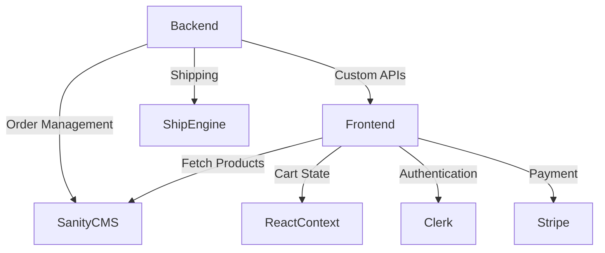

# Marketplace Builder Hackathon [3] 2025

**E-Commerce Website Interface Kit + Design System**

## Objective
To build a scalable, user-friendly e-commerce platform with the following features:
- Product browsing and management via Sanity CMS.
- Authentication using Clerk.
- Order tracking with ShipEngine API.
- Secure payments via Stripe.
- Modern tools like `useContext` for cart functionality.

---

## System Architecture Diagram


---

## Features & Workflow

### Frontend
**Tech Stack:**
- **Frameworks/Libraries:** Next.js, React

**Core Pages and Components:**
- Home
- Product Listing
- Product Details
- Cart
- Checkout
- Order Confirmation

**Functionality:**
1. **Product Browsing:**
   - Fetch and display products from Sanity CMS using GROQ queries.
2. **Cart Management:**
   - Use `useContext` to manage cart state globally.
   - Add/remove items and calculate totals dynamically.
3. **Checkout Process:**
   - Collect user details and payment via Stripe-hosted checkout.
   - Display order confirmation after successful payment.
4. **Order Tracking:**
   - Generate shipping label IDs using ShipEngine.
   - Provide label ID to users for tracking.

### Backend
**Tech Stack:**
- Sanity CMS

**Core Features:**
1. **Sanity CMS:**
   - Manage products and orders using Sanity Studio.
2. **Custom APIs:**
   - `/api/products`: Fetch product data.
   - `/api/shipping-label`: Generate shipping labels using ShipEngine.
   - `/api/track-order`: Retrieve tracking details using ShipEngine.
   - `/api/checkout`: Integrate with Stripe for payments.
3. **Admin Panel:**
   - Use Sanity Studio for inserting and managing data.

---

## API Endpoints

| Endpoint       | Method | Purpose                       | Example Response                                   |
|----------------|--------|-------------------------------|---------------------------------------------------|
| `/api/products`| GET    | Fetch all product details     | `{ "id": 1, "name": "Product A", "price": 100 }` |
| `/api/orders`  | POST   | Create a new order            | `{ "orderId": 123, "status": "Success" }`         |
| `/api/shipment`| GET    | Track order status            | `{ "shipmentId": 456, "status": "In Transit" }`  |

---

## Tools & Libraries
- **Clerk:** Authentication.
- **Sanity CMS:** Content management.
- **ShipEngine API:** Shipping and tracking.
- **Stripe:** Payment gateway.
- **React Context API:** Cart functionality.

---

## Data Models

### Product Schema
```javascript
export default {
  name: 'product',
  type: 'document',
  fields: [
    { name: 'name', type: 'string', title: 'Product Name' },
    { name: 'price', type: 'number', title: 'Price' },
    { name: 'stock', type: 'number', title: 'Stock Level' }
  ]
};
```

---

## Deliverables
1. **System Architecture Diagram:** Shows component interaction.
2. **Sanity Schemas:** For products and orders.
3. **API Endpoints:** For shipping, tracking, and payments.
4. **Frontend Pages:** Authentication, product browsing, cart management, and order confirmation.
5. **Portfolio-Ready Submission:** Polished project showcasing full-stack e-commerce skills.

---

## Author
**Vandana Chohan**

---

## License
This project is licensed under the MIT License. See the LICENSE file for details.
